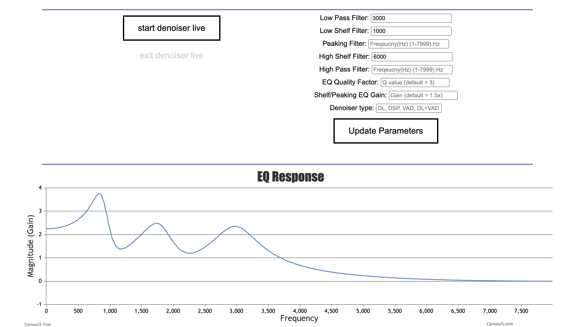

# EE434 Project Update

A software that receive audio & video input and enhance them in real time. Possible application: meeting (using feedback loop in apps like Zoom) and speech/lecture recording/streaming. The software will denoise the received audio, adjust EQ and enhance the audio performance based on video infomation.

Team: Michael Pozzi, Matt Baseheart, Yuzhou He

How it works:
    
    [Note: 16k Hz for speech detection + single channel for speed]

    [Note: the server and client can be run on different or same device. Server can be Jetson and Client can be PC.]

    [Note: all the processes below run on different threads at the same time.]

    0. Client receives EQ parameters and audio chain components from user input, and update to server

    1. Client program receive audio input from microphone
    
    2. Raw input is passed to Voice Activity Detection module (optional, only recommended when using Demucs)

        If VAD is on and speech detected: Client send the audio data to Server through UDP

    3. Server receives the raw audio, and passes it to denoiser (either DSP or DL)

    4. Server send the denoised audio back to the Client through UDP

    5. Client passes the denoised audio to EQ

    6. Client receives distance information from video processor

    7. Client adjust the volume based on distance

    8. Client output the audio to the output device
    
Note: [two denoisers are included, one based on Demucs network ("DL"), one based on OMLSA + IMCRA algorithm ("DSP")] The Demucs network is trained on the entire valentini dataset + DNS dataset with hidden size = 48, plus some office/room noises downloaded from youtube and Audioset. The Demucs Network runs slow on CPU, so DSP denoiser is prefered. Demucs can run in real time on 4 i-5 cpu cores, add VAD module can help reduce the computation when no speech is detected.]

    Video Module (works separately from flask app):

        1. Detect and mark face 

        2. Detect Eyes and measure eye separations (support glasses). Using moving average filter for stable output.

        3. Estimate distance using eye separation and focal length

        4. Send distance information to Audio Client

        5. Send position information to Pan-Tilt Camera / digital zoom

Pipelines:

To run the flask server (linux/mac):

Download "denoiser.th" from drive. 

Move "[denoiser.th](https://drive.google.com/file/d/17WuFlrUMJZdYiYEqvBfq4hmAd3x_NwDm/view?usp=sharing)" to 434-project/Processor/Audio_Server/denoiser/denoiser.th

    1. pip3 install -r requirements.txt

    2. on Jetson or on any device for server (need to run server first to allow UDP binding):

        cd 434-project/Processor/Audio_Server

        python3 main.py

    3. on PC or any device for client (needs to have sounddevice):
    
        cd 434-project/Processor/Audio_Client

        flask run

    4. connect the video processor to the audio chain:

        cd 434-project/Processor/Video
        
        python3 dlib_distance_detector.py

(Note: we include a dlib face_landmark model for eye detection with glasses, and a python-opencv model for eye detection without glasses. Both works well with no glasses case. However, the dlib package is harder to install, and the model is larger because it includes the entire face map)

    5. open flask site in chrome "http://127.0.0.1:5000/")

[Note: The default IP configuration allows you to run both client and server on the same device. (127.0.0.1) You need to reconfigure the ip and port if you are running them on separate devices.]
    

Note:

If you want to test out individual modules:

    Voice Activity Detection:

        cd 434-project/etc/individual\ modules/Voice_Activity_Detection/env
        
        flask run

    Real Time OMLSA Algorithm:

        cd 434-project/etc/individual\ modules/real_time_omlsa 

        python3 main.py
    
    Non-real time OMLSA Algorithm with file input (can plot the result):

        cd 434-project/etc/individual\ modules/fast_omlsa

        python3 main.py

    Demucs Denoiser (support file upload):

        cd 434-project/etc/v1/env\ \(v1.1\)

        flask run 

Common Errors and Warnings:

If OSX limits the maximum UDP-package to be 9216, input the following command in terminal to remove the restriction:

    sudo sysctl -w net.inet.udp.maxdgram=65535

If dlib fails to install, try to install from source (the following code works for OSX):

    git clone https://github.com/davisking/dlib.git

    cd dlib

    mkdir build; cd build; cmake ..; cmake --build .

    cd ..

    python3 setup.py install

    (if assert error happens, delete the lines with the assert(false) statement in the error files)
    

If there is an error that says "the selected port is already binded" or anything similar:

    Go to main.py in Audio_Server and app.py in Audio_Client, change all the port from 9999-9996 to any other port in 9000-9999 range. 
    
    This error is because the UDP receiver is closed before sender. 
    
    You should always open UDP receiver first, and close UDP sender first. 
    
    (which means run Server main.py file before Client flask run, and close Client window before server when quit the program.)